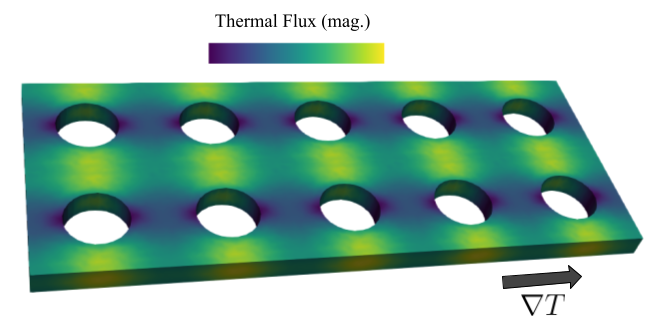

[](https://github.com/romanodev/OpenBTE/blob/master/LICENSE)
[](https://openbte.readthedocs.io/en/latest/)
[](https://pypi.org/project/openbte/)
[](https://hub.docker.com/r/romanodev/openbte)
[](https://colab.research.google.com/drive/18u1ieij2Wn6WEZFN2TmMteYHAJADMdSk?usp=sharing)
[](https://www.python.org/)

OpenBTE solves the Linearized Boltzmann Transport equation, with current focus on steady-state phonon transport.

```python

from openbte import Material,Geometry,Solver,Plot

Material(filename='rta_Si_300') #Retrieves data from the database

Geometry(lx = 50,ly = 50, lz=10,step=4,porosity=0.2,shape='circle') #Creates the structure

Solver() #Solves the BTE

Plot(model='vtu',repeat=[5,1,1]) #Creates a file which can be open with Paraview

```




