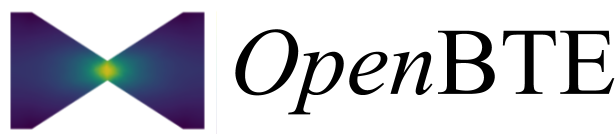

OpenBTE solves transport at the nondiffusive level. Current focus is phonon transport. 

Developed by Giuseppe Romano (romanog@mit.edu).

**References**:

G. Romano, OpenBTE: a Solver for ab-initio Phonon Transport in Multidimensional Structures, arXiv:2106.02764, (2021) [Link](https://arxiv.org/abs/2106.02764)

G. Romano and S. G. Johnson, Inverse design in nanoscale heat transport via interpolating interfacial phonon transmission, Structural and Multidisciplinary Optimization, (2022)  [Link](https://arxiv.org/abs/2202.05251) 

G. Romano, Efficient calculations of the mode-resolved ab-initio thermal conductivity in nanostructures, arXiv:2105.08181 (2021) [Link](https://arxiv.org/abs/2105.08181)  

G. Romano, A Di Carlo, and J.C. Grossman, Mesoscale modeling of phononic thermal conductivity of porous Si: interplay between porosity, morphology and surface roughness. Journal of Computational Electronics 11 (1), 8-13 52 (2012) [Link](https://link.springer.com/article/10.1007/s10825-012-0390-2)

