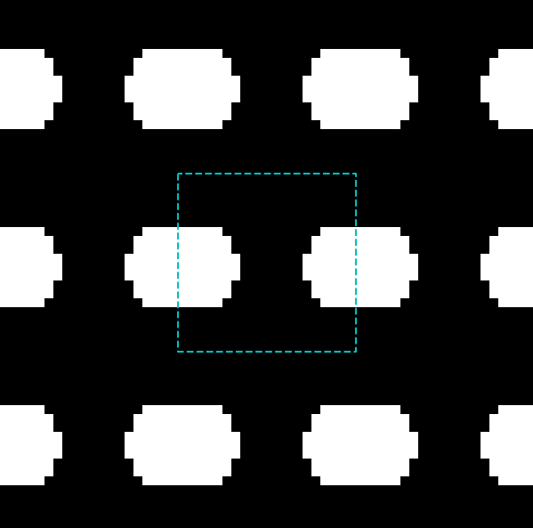

Example 2: Inverse Design (NEW!)
=================================

In this example, we will design a nanomaterial withi a prescribed effective thermal conductivity tensor (diagonal components). To this end, we first get a BTE solver, specifically developed for inverse design

.. code-block:: python

   from openbte.inverse import bte

   grid = 20

   f = bte.get_solver(Kn=1, grid=grid,directions=[[1,0],[0,1]])

The function ``f`` takes the material density and gives the effective thermal conductivity tensor as well as its gradient wrt the material density. It is a differentiable function, i.e. it can be composed with arbitrary JAX functions to obtain end-to-end differentiability. This approach allows us to write down generic cost functions. In this case, we want to minimize :math:`||\kappa - \tilde{\kappa} ||`, where :math:`\tilde{\kappa}` is the desired value

.. code-block:: python

   from jax import numpy as jnp

   kd = jnp.array([0.3,0.2])
   def objective(x):

        k,aux  = f(x)

        g  = jnp.linalg.norm(k-kd)

        return g,(k,aux)

As you can see there gradient is managed automatically. Finally, the optimization is done with

.. code-block:: python

   from openbte.inverse import matinverse as mi

   L = 100 #nm
   R = 30  #nm

   x = mi.optimize(objective,grid = grid,L = L,R = R,min_porosity=0.05)

where ``R`` is the radius of the conic filter. Lastly, you can visualize the structure with

.. code-block:: python

   mi.plot_2D(x)

