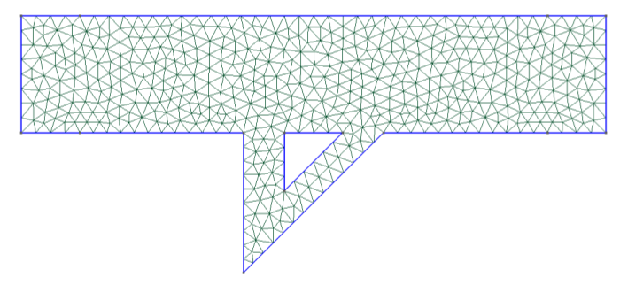

Geometry 
===================================

A geometry object can be created with the ``Geometry`` class.

.. code:: python

   Geometry(model=('lattice')|'custom'|'bulk')

The default model is ``lattice``. All the models are based on a unit cell of size ``lx`` and  ``ly`` (in nm). Optionally, a thickness ``lz`` can be added. Note that ``3D`` simulations are experimental and not currently supported. Periodic boundary conditions are applied throughout the unit cell, unless the ``Periodic`` option is defined. An applied difference of temperature :math:`\Delta T =` 1 K is applied along :math:`x`. The ``bulk`` is simply a square repeated along :math:`x` and :math:`y`. In-plane thermal conductivity of a thin film can be created with

Bulk
-------------------------------------

The ``bulk`` is simply a square repeated along :math:`x` and :math:`y`

.. code:: python

   Geometry(model='bulk',lx=100,ly=100, stpe=5)

Diffuse scattering boundary conditions are applied to the top and bottom surfaces.

Film
-------------------------------------

Within OpenBTE, a thin film is just a ``bulk`` model with diffuse boundary conditions at the top and bottom surfaces

.. code:: python

   Geometry(model='bulk',lx=100,ly=100, stpe=5,Periodic=[True,False,True])

Porous
----------------------------------------

Porous materials can be defined with the ``lattice`` model. Options include a `porosity` (i.e. the volume fraction), a `base` - i.e. the position of the pores in the unit-cell and a `shape`. Below is a complete list of options. Additionally, the mesh step size (``step``) must be include. For example:

.. code:: python

   Geometry(model='lattice',lx = 10,ly = 10, step = 0.5, base = [[0.2,0],[-0.2,0]],porosity=0.1,shape='circle')

Additional info/tips:

 - Commonly, a shape may cross one or even two boundaries of the unit-cell. The user needs `not` to include in the base the image pore, since OpenBTE will automatically added it.

 - The base has the range :math:`x\in [-0.5,0.5]` and :math:`y\in [-0.5,0.5]`

 - When two pores overlap, including the cases where the overlap is due to periodicity, a bigger pore - the union of the two overlapping pores, is created.

 - The area of the pores is defined by the chosen porosity, the shape and number of pores in the base. For example, when the number of pores in the base doubles - with all other parameters being equal, the area of each pore halves.

 - The ``step`` keyword defined the characteristic size of the mesh. In 2D domains, the number of elements will be roughly :math:`lx*ly/\mathrm{step}^2`.  Typical calculations have 400-10 K elements. 
 
 - Diffuse scattering boundary conditions are applied along the walls of the pores.

 - A shape can be either a predefined one - including ``square``, ``triangle`` and ``circle`` - or user defined, as outlined in the next section.

Pores with different size/shapes
##########################################

To have pores with different sizes, you can use the option ``area_ratio``, which takes a list of ``relative`` areas for each pores. Note that the total area will still be set by the porosity. Example:

.. code:: python

   Geometry(model='lattice',lx = 10,ly = 10, step = 0.5, base = [[0.2,0],[-0.2,0]],porosity=0.1,shape='circle',area_ratio=[1,2])

In this case the second pore would be twice as large as the first one. Optionally, you can also define a vector of shapes, e.g. ``shape=['circle','square']``. An example is reported in Example 1.

Custom shapes
##########################################
 
Custom shapes (which should not be confused with custom geometry mode, defined below) can be created with ``shape=custom``. The user-defined structure is identified with ``shape_function`` and its options, ``shape_options``. See Example 2 for further clarifications.

Additional info/tips:

  - The shape coordinates are normalized to :math:`(-0.5,0.5)` both in :math:`x` and :math:`y` coordinates.
  - The shape function must at least take the option ``area`` in input, which is internally calculated, so that the nominal porosity is respected. Note that ``area`` is normalized to the unit square. The workflow is this: 1) decide the porosity of your material 2) based on the option ``area_ratio``, assign a porosity to each pore. If ``area_ratio`` is not assigned, then the porosity of each pore is the porosity of the material. 3) Build your structure using custom options.
  - The values for ``shape_options`` can also be a ``list`` with the same size as the number of pores. In this case, these values are passed separately to the pores.
    
For an example, see Example 2.

.. code:: python

   from openbte import Geometry
   import numpy as np

   def shape(options):
    area = options['area']
    T = options['T']
    f = np.sqrt(2)

    poly_clip = []
    a = area/T/2

    poly_clip.append([0,0])
    poly_clip.append([a/f,a/f])
    poly_clip.append([a/f-T*f,a/f])
    poly_clip.append([-T*f,0])
    poly_clip.append([a/f-T*f,-a/f])
    poly_clip.append([a/f,-a/f])

   return poly_clip
   
   geo = Geometry(porosity=0.05,lx=100,ly=100,step=5,shape='custom',base=[[0,0]],lz=0,save=False,shape_function=shape,shape_options={'T':0.05})

Custom
-----------------------------------------------------

With the custom model, the structured is defined a series of polygons defining the regions of the material to be carved out. Below is an example 

.. code:: python

   from openbte import Geometry

   k = 0.1
   h = 0.1
   d = 0.07
   poly1 = [[-k/2,0],[-k/2,-h],[k/2,0]]
   poly2 = [[-0.6,0],[-0.6,-0.8],[0.6,-0.8],[0.6,-0],[k/2+d,0],[-k/2-d,-k-2*d],[-k/2-d,0]]

   Geometry(model='custom',lx=100,ly=100,step=5,polygons = [poly1,poly2])

Note that the coordinates are within the :math:`(-0.5,0.5)` range. 

Additional info/tips:

 - If you want to work with unnormalized coordinate use ``relative=False``. 
 
 - Pores that cross the boundaries are repeated. You can turn off this behaviour by using ``repeat=False``. 

