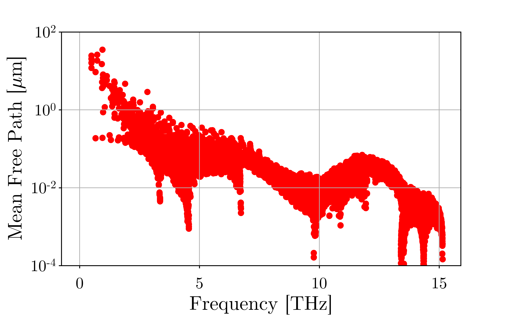

Plot
===================================

The ``Plot`` module helps visualize results, based on the file ``material.h5``, ``geometry.h5`` and ``solver.h5``, which must be in the current directory.

Internal Viewer
###################################

OpenBTE features its own viewer, based on plotly_. This experimental feature can be invoked with

.. code:: python

   Plot(model='maps',repeat=[2,2,1])

where ``repeat`` is used to plot the supercell. Nodes, that OpenBTE includes the periodic boundary conditions in translating cell data to node data. 

Here is an example:

.. raw:: html

    <iframe src="_static/plotly.html" height="475px" width="65%"  display= inline-block  ></iframe>

Note that the external viewer can also be run with

.. code:: bash

   gui

where ``repeat=[2,2,1]`` is assumed.   

External Viewer
####################################

Alternatively, it is possible to write results in the ``vtu`` format

.. code:: python

   Plot(model='vtu',repeat=[2,2,1])

The created file ``output.vtk`` can be read by Paraview_

Mode-resolved effective thermal conductivity
############################################
Once you have calculated the effective thermal conductivity, you may want to interpolate back the results on the original mode-resolved grid (e.g. the one used for bulk). You can do so with the model ``kappa_mode``.

.. code:: python

   Plot(model='kappa_mode')

Notes/limitations:

- kappa_mode works only with the material model ``rta2DSym``.

- The files ``solver.npz``, ``material.npz`` and ``rta.npz`` must be in your current directory.

Formulation
############################################

The effective thermal conductivity, after interpolation, can be computed as 

.. math::

   \kappa^{\mathrm{eff}}_\mu = C_\mu v_\mu^x \Lambda_\mu^{x,\mathrm{eff}}
 
where

.. math::

  \Lambda_\mu^{x,\mathrm{eff}}= \frac{L}{\Delta T A_{\mathrm{hot}}}\int_{A_\mathrm{hot}} dS \Delta T_\mu(\mathbf{r}).

The mean free path is then defined as

.. math::

   \Lambda_\mu = \sqrt{(\Lambda^y_\mu)^2 + (\Lambda^z_\mu)^2 +   (\Lambda_\mu^{x,\mathrm{eff}})^2}

Note the the effective projected mean-free-path above also includes the macroscopic geometrical effect.  

  

   

.. _Plotly : https://plotly.com/
.. _Paraview : https://www.paraview.org/

