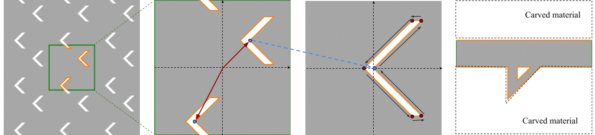
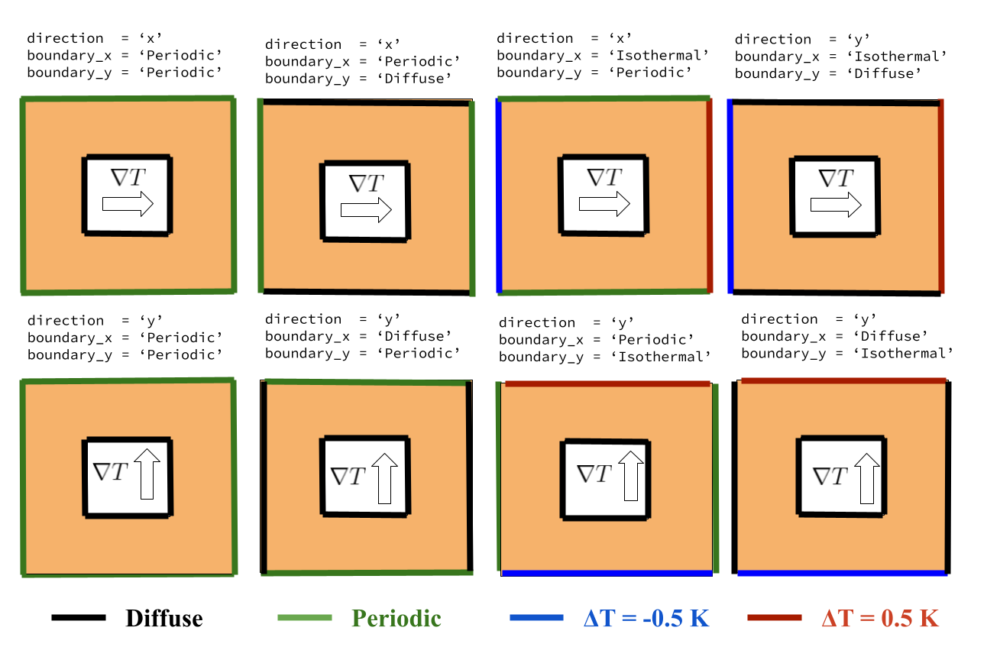
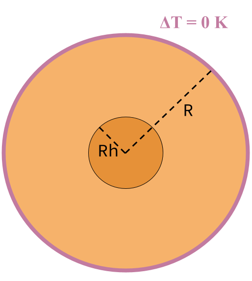

Geometry 
===================================

``OpenBTE`` reads generic 2D ``.geo`` files from gmsh_. The supported boundary conditions are diffusive adiabatic, thermostatting and periodic. Non-equilibrium phonon populations can either be induced by an external temperature gradient or heat source. In most cases, it is possible to create the ``geo`` file just by providing high-level information about the simulation domain and boundary conditions. The module ``Geometry`` fulfills this task. There are currently three geometry models, as outlined below.

.. table:: 
   :widths: auto
   :align: center

   +----------------------+---------------------------------------------+-----------------------+
   | **Option**           |     **Note**                                |     **Default**       |  
   +----------------------+---------------------------------------------+-----------------------+
   |     ``step``         |      mesh size [nm]                         |      required         |     
   +----------------------+---------------------------------------------+-----------------------+
   | ``delete_gmsh_files``|     wheather to delete ``gmsh`` files       |      ``True``         |     
   +----------------------+---------------------------------------------+-----------------------+

Lattice
----------------------------------------

Porous materials can be defined with ``model=lattice`` model. Options include `porosity` (i.e. the volume fraction), `base` - i.e. the position of the pores in the unit-cell and `shape`. Below is a complete list of options:

.. table:: 
   :widths: auto
   :align: center

   +-------------------+---------------------------------------------+--------------------------+
   | **Option**        |     **Note**                                |     **Default**          |  
   +-------------------+---------------------------------------------+--------------------------+
   |     ``lx``        | lenght along x       [nm]                   |      required            |     
   +-------------------+---------------------------------------------+--------------------------+
   | ``porosity``      | volume fraction                             |      required            |     
   +-------------------+---------------------------------------------+--------------------------+
   |     ``shape``     | ``circle``, ``square`` or ``triangle``      |      ``circle``          |
   +-------------------+---------------------------------------------+--------------------------+
   |     ``ly``        | lenght along y [nm]                         |      ``lx``              |
   +-------------------+---------------------------------------------+--------------------------+
   |   ``repeate``     | Add periodic pores                          |      ``True``            |
   +-------------------+---------------------------------------------+--------------------------+
   |     ``base``      | local coordinate of the pores               |       ``[[0,0]]``        |
   +-------------------+---------------------------------------------+--------------------------+
   | ``shape_function``| function for a custom shape                 |       ``None``           |
   +-------------------+---------------------------------------------+--------------------------+
   | ``boundary``      | boundary conditions                         | ``[Periodic,Periodic]``  |
   +-------------------+---------------------------------------------+--------------------------+
   | ``relative``      | relative coordindate for shape definition   |       ``True``           |
   +-------------------+---------------------------------------------+--------------------------+
   | ``area_ratio``    | ratio of the areas of the pores             |       ``None``           |
   +-------------------+---------------------------------------------+--------------------------+
   | ``shape_options`` | options for each custom shape               |       ``None``           |
   +-------------------+---------------------------------------------+--------------------------+

.. code:: python

   Geometry(model='lattice',lx = 10,ly = 10, step = 0.5, base = [[0.2,0],[-0.2,0]],porosity=0.1,shape='circle')

Pores with different size/shapes
##########################################

To have pores with different sizes, you can use the option ``area_ratio``, which takes a list of relative areas for each pores. Note that the total area will still be set by the porosity. Example:

.. code:: python

   Geometry(model='lattice',lx = 10,ly = 10, step = 0.5, base = [[0.2,0],[-0.2,0]],porosity=0.1,shape='circle',area_ratio=[1,2])

In this case the second pore would be twice as large as the first one. Optionally, you can also define a vector of shapes, e.g. ``shape=['circle','square']``. 

In the figure above a case of custom shape (first three panels) and custom model (last panel) are shown.

Custom shapes
##########################################
 
Custom shapes (which should not be confused with custom geometry model) can be created with ``shape=custom``. The user-defined structure is identified with ``shape_function`` and its options, ``shape_options``. The shape coordinates are normalized to :math:`(-0.5,0.5)` both in :math:`x` and :math:`y` coordinates. Multiple shape functions can also be declared in lists. The shape function must at least take the option ``area`` in input, which is internally calculated, so that the nominal porosity is respected. Note that ``area`` is normalized to the unit square. The values for ``shape_options`` can also be a ``list`` with the same size as the number of pores with custom shape. In this case, these values are passed separately to the pores. Here is an example of a custom shape model:

.. code:: python

   from openbte import Geometry
   import numpy as np

   def shape(options):
    area = options['area']
    T = options['T']
    f = np.sqrt(2)

    poly_clip = []
    a = area/T/2

    poly_clip.append([0,0])
    poly_clip.append([a/f,a/f])
    poly_clip.append([a/f-T*f,a/f])
    poly_clip.append([-T*f,0])
    poly_clip.append([a/f-T*f,-a/f])
    poly_clip.append([a/f,-a/f])

   return poly_clip
   
   geo = Geometry(porosity=0.05,lx=100,ly=100,step=5,shape='custom',base=[[0,0]],lz=0,save=False,shape_function=shape,shape_options={'T':0.05})

Custom
##################################

With ``model=custom`` it is possible to create a geometry by directly defining a series of polygons   

.. code:: python

   from openbte import Geometry

   k = 0.1
   h = 0.1
   d = 0.07
   poly1 = [[-k/2,0],[-k/2,-h],[k/2,0]]
   poly2 = [[-0.6,0],[-0.6,-0.8],[0.6,-0.8],[0.6,-0],[k/2+d,0],[-k/2-d,-k-2*d],[-k/2-d,0]]

   Geometry(model='custom',lx=100,ly=100,step=5,polygons = [poly1,poly2])

The resulting shape is illustrated in the last panel of the figure above. Similarly to the ``lattice`` model, shapes that cross the boundaries are repeated periodically. This feature can be turned off with ``repeat=False``. Lastly, working with unnormalized coordinates can be enabled with ``relative=False``. 

Boundary conditions
##################################

An external temperature gradient can be specified with ``direction='x'``. In this case, the component ``xx`` of the effective thermal conductivity tensor is evaluated. Boundary conditions can be applied using the keyword ``boundary = [boundary_x,boundary_y]``, where each element of the list can be ``Periodic``, ``Diffuse`` or ``Isothermal``. Note that along the applied perturbation, the only suitable keywords are ``Periodic`` and ``Isothermal``, while for the other directions one must use either ``Diffuse`` or ``Periodic``. In the case of ``Isothermal`` boundaries, the hot and cold contacts are thermalized to the deviational temperatures -0.5 K and 0.5 K, respectively. Lastly, the internal boundaries are always diffuse.

Heat source
##################################

In addition to applying a difference of temperature, it is possible to add heat source/sink. To do so, we simply use the model ``lattice`` and assign to some pores a heat source we want. Furthermore, it is possible to switch off the applied temperature gradient with ``apply_gradient=False``. For example:

.. code:: python

   G = 1e3
   Geometry(model='lattice',lx = 10,ly = 10, step = 0.5, base = [[0.2,0],[0,0],[-0.2,0]],porosity=0.1,shape='circle',apply_gradient=False,heat_source=[G,None,-G])

In the example above, we have an heat source, a heat sink and one pore.

Disk
--------------------------------

With ``model=disk`` it is possible to have a disk a simulation domain. This scenario is particularly useful when studying heat transport in the presence of heat sources. Besides the common flags, two additional parameters need to be specified, ``R`` and ``Rh``, i.e' the radious of the disk and the heated region, respectively. Lastly, the intensity of the heat source is specified by ``heat_source``. The boundary of the disk are thermalized to the deviational temperature of :math:`\Delta T = 0 K`. Here is an example

.. code:: python

   from openbte import Geometry

   Geometry(model='disk',R=10,Rh=1,step=0.5,heat_source=0.5)

Here is an illustration for the disk simulation domain

.. _gmsh: https://gmsh.info/

